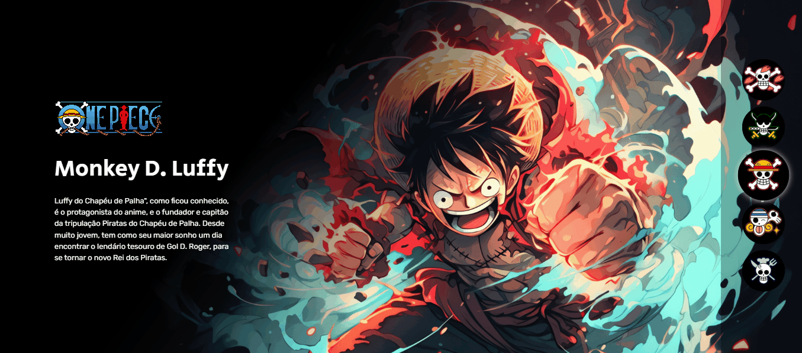

# Projeto One Piece: Seleção de Personagem
Este projeto é uma seleção de personagem para os membros do chapeu de palha realizado na Semana do Zero ao Programador Contratado (SZPC) do Dev em Dobro. 
Os usuários podem selecionar um personagem de uma lista de 5 personagens, incluindo Luffy, Zoro, Nami, Sanji e Chopper.

O projeto foi desenvolvido usando HTML, CSS e JavaScript. 
O código está bem organizado e comentado, tornando-o fácil de entender e manter.

<h3>Funcionamento</h3>
Ao clicar no icone do personagem na lista, ele será selecionado. 
A imagem, o nome e a descrição do personagem grande serão alterados para refletir o personagem selecionado.

<ol>
<li>Primeiramente, o código obtém todos os elementos da classe .personagem e .botao.</li>
<li>Em seguida, o código itera por cada botão, adicionando um ouvinte de evento de clique a cada um deles.</li>
<li>Quando o evento de clique é acionado, o código realiza as seguintes ações:
  <ul>
   <li>Verifica se já existe um botão ou personagem selecionado. Se existir, remove a seleção de ambos.</li>
   <li>Adiciona a classe "selecionado" ao botão clicado e ao personagem correspondente, identificado pelo índice associado ao botão na lista.</li>
  </ul>
 </li>
<li>O código também inclui funções auxiliares:
  <ul>
    <li><code>desselecionarPersonagem</code>: Remove a classe "selecionado" do personagem que estava previamente selecionado.</li>
    <li><code>desselecionarBotao</code>: Remove a classe "selecionado" do botão que estava previamente selecionado.</li>
  </ul>
</li>
</ol>

Este conjunto de funcionalidades proporciona a visualização dinâmica de informações sobre personagens quando os botões correspondentes são clicados, promovendo uma experiência interativa ao usuário.

<h3>Como usar</h3>
Para usar o projeto, basta abrir o arquivo index.html em um navegador da web. Você poderá então selecionar um personagem da lista. 
O personagem selecionado será exibido na seção "Personagem selecionado".

<h3>Suporte</h3>
Se você tiver algum problema com o projeto, não hesite em entrar em contato conosco. 
Estamos sempre procurando maneiras de melhorar o projeto, então não hesite em nos enviar suas sugestões.
